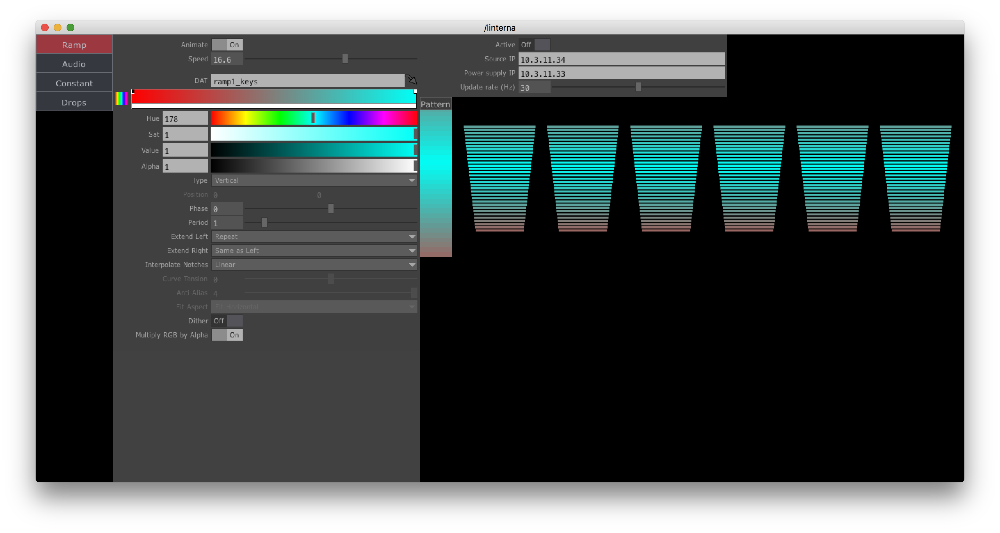
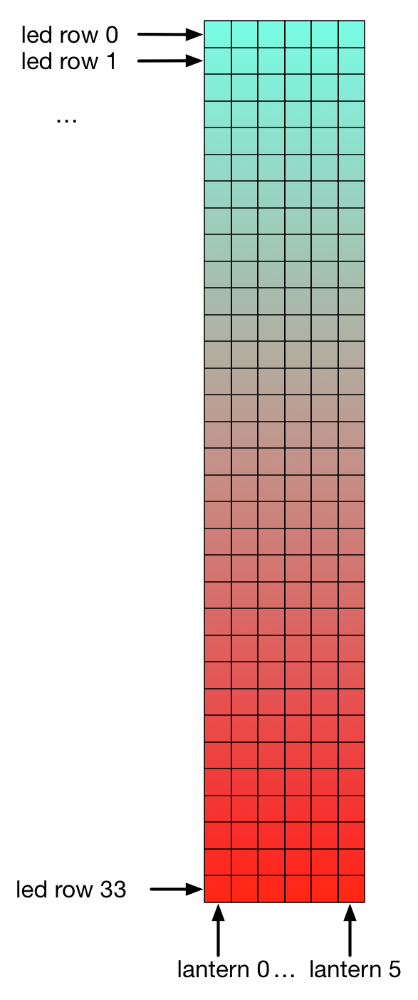

# Linterna control TouchDesigner component

## Description

This a repository for TouchDesigner control UI for the lanterns of the [Linterna](https://github.com/remap/linterna) project.
The control code is written using Python, so the component will work with free versions of TouchDesigner.

## Setup

Lanterns control is performed over direcvt Ethernet connection to the lantern's power supply box. In order to send commands, one needs to know box's IP address and set control machine's IP address accordingly.

> For example, if power supply box has IP address `10.3.11.33`, after connecting ethernet cable to your laptop, you may set your laptop's IP address to `10.3.11.34`. Please, take a note of these addresses, you'll need them later.

> Power supply box's IP address can be found on its' front panel display, by navigating to the network settings menu.

## How to use

1. Open `linterna.toe` (or drag `linterna.tox` to your currently opened TouchDesigner window).
2. Right-click on `linterna` copmonent and select `View`. You'll see the interface, similar to this:

The UI consists of three vertical parts (from left to right):

- Controls tabs
- Controls UI
- Linterna settings & preview

### Controls tabs

Tabs for switching between different controls that generate image patterns for the latnerns (see more below on lanterns image pattern).

### Controls UI

Every control panel has a number of parameters specific to the type of lantern control. For example, `Constant` has the simplest interface of choosing just one color for all lanterns, while `Ramp` has much more sophisticated parameters for specifying gradient color pattern.

Controls can be added by user. See [How to expand](#Howtoexpand) for more information about expansion.

### Linterna settings & preview

This panel shows linterna's basic settings, like IP addresses of power supply and control machine (where TouchDesigner is running) and refresh rate - how often messages are sent to the power supply.

Preview shows incoming image pattern for the lanterns and actual preview per lantern. Lantern image pattern is a simple TOP texture, with resolution 6x33 pixels. The lowest level of lantern control is per pixel row. There are approximately 33 LED rows in each lantern. Here's the image explaining the pattern image:

## How to expand

UI can be expanded with new control tabs by following these rules:

* Controls shall be placed in a `Component COMP`
* Inside the components, these OPs are required:
  * `Text DAT` named `tab_name` with Tab Name that will be displayed in UI
  * `Out TOP` with resolution 6x33 - this image will be used as lantern pattern image
  * `COMP` named `ui` (panel size shouldn't be larger than 600x700 for proper UI rendering) which will be used to display controls in the UI
  
Take a look inside `tabs` COMP to get better understanding of how UI is wired. You'll also need to wire your output to the switch and connect it as a child to `container1` component.
